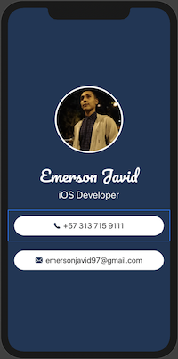

# ContactProfile
First APP with SwiftUI

Applying the concepts:

* Work with Xcode preview and the object library to generate SwiftUI code 
* Use SwiftUI modifiers to set properties to components
* SwiftUI Stacks
* Custom Fonts
* Work with RGB colors and HEX codes
* extract Subviews to create reusable SwiftUI components

# Funcinality
Its a beautiful card presentation or contact profile of a software developer.

## Screenshots

